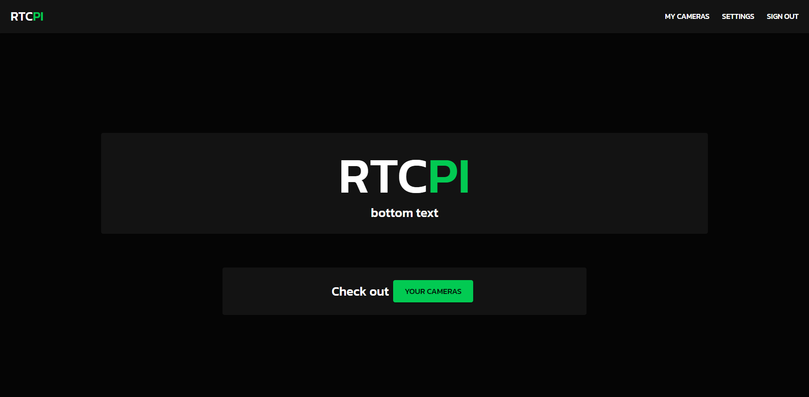
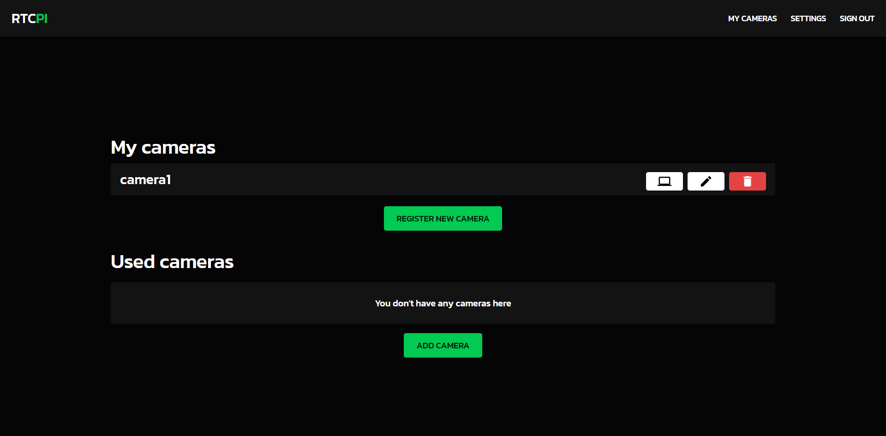
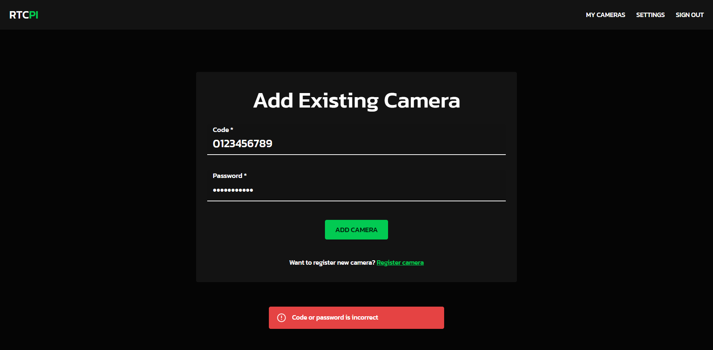

# RTC PI

Streaming raspberry pi camera to web browser - frontend part (NOT FINISHED YET)

## Installation

Download or clone repository

Add .env file

```
REACT_APP_BASE_URL=...
PORT=...
```

Run

```bash
# installing dependances
$ yarn install
```

## Running the app

```bash
# development
$ yarn start
```

## Views

### HomePage view



### Dashboard view



### Add camera view


